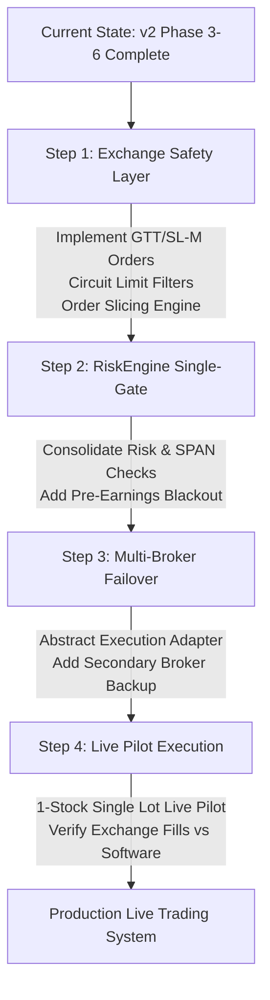

# Comprehensive Architecture & Strategy Review: NSE/BSE Real-World Algo-Trading Readiness

**Target Workspace:** `/home/nithin/code/agent/Claude/trading-platform`  
**Date:** August 16, 2026  
**Scope:** Deep-dive evaluation of application design, Rust compute core, realtime tick pipeline, strategy backtesting/walk-forward engine, risk architecture, and production gaps for live trading on the National Stock Exchange (NSE) and Bombay Stock Exchange (BSE).

---

## Executive Summary

The **Personal Stock Suggestion & Algo-Trading Platform** represents a highly disciplined, quant-grade system built specifically for Indian financial markets (NSE/BSE). Built around a **weighted confluence engine** ($\ge 70\%$ confidence gate), a **Rust compute core** (`tradecore`), a tick-to-tick realtime execution worker on Zerodha Kite, and strict paper-first risk management, the platform avoids common retail traps like single-indicator signals, look-ahead bias, and repainting.

This document provides a detailed breakdown across three core dimensions:
1. **What Went Good**: Architectural achievements, performance wins, risk rails, and spec discipline.
2. **What Went Bad**: Current design gaps, technical debt, signal edge limitations, and operational vulnerabilities.
3. **What Could Have Been Done Better for Real-World NSE/BSE Trading**: Tactical and structural enhancements required to safely transition from paper trading to live capital deployment under Indian exchange (NSE/BSE) and SEBI regulatory realities.

---

## 1. What Went Good (Strengths & Architectural Highlights)

### 1.1 High-Performance Compute Core (`tradecore`) & Parity Discipline
- **Sub-Millisecond Engine Acceleration**: Replaced Python/pandas O($N^2$) backtesting with a compiled **Rust workspace** (`engine-core` + PyO3 PyO3 bindings via `tradecore`). Reduced 2-year $\times$ 49-stock backtest evaluation time from **883.8 seconds to 0.143 seconds (~6,180$\times$ speedup)**.
- **Zero Live-vs-Backtest Drift**: The exact same Rust engine computes indicators, confluence scores, and risk sizing in both offline backtests/sweeps and live tick processing, completely eliminating live-vs-backtest logic drift.
- **Golden Fixture Parity Protocol**: Established strict cross-language numeric and decision parity against frozen Python reference fixtures ($10^{-9}$ relative precision on EMAs, exact integer equality on factor scores and signal decisions).

### 1.2 No Look-Ahead, No Repainting Architecture
- **Committed vs. Forming Layer Separation**: Signal decisions are strictly decoupled:
  - **Committed Signals**: Evaluated strictly on **completed candle closes** (Candle $N$), valid for entry from Candle $N+1$ open. Guaranteed non-repainting, idempotent, and backtestable.
  - **Forming / Provisional Signals**: Tick-level indications computed in real time for UI alerts/leaderboards, explicitly tagged as provisional, and hard-isolated from backtests and accounting.
- **Idempotent Signal Generation**: Prevents redundant signal creation during multi-candle setups via persistent state tracking per `(stock, timeframe, direction)`.

### 1.3 Honest Accounting & Institutional Cost Modeling
- **Realistic Zerodha Fee Schedule**: Paper broker models full Indian cash-equity transaction friction, including STT (Securities Transaction Tax), Exchange Transaction Charges (NSE), Stamp Duty, SEBI turnover fees, Brokerage caps, and GST (18%).
- **Adverse Slippage Modeling**: Applies mandatory fill slippage (default 2 bps) where BUY orders fill higher and SELL orders fill lower.
- **Gap-Through Execution Engine**: Recognizes that gap-down/gap-up exits book the **actual opening price** rather than the stop-loss price, exposing fill-flattery and providing truthful net P&L tracking.

### 1.4 Hardened Risk Management & Non-Disableable Circuit Breakers
- **Risk-First Position Sizing**: Every signal computes quantity dynamically via:
  $$\text{Quantity} = \left\lfloor \frac{\text{Capital} \times \text{Risk}\%}{|\text{Entry} - \text{StopLoss}|} \right\rfloor$$
- **Max-SL Rejection Policy**: Rejects setups where the natural technical stop exceeds timeframe classification caps (e.g., Intraday $0.5\%$, Swing $8\%$) rather than dangerously tightening the stop loss.
- **Immutable Daily Loss Breaker**: Implements a non-disableable daily P&L circuit breaker that blocks new order creation when daily losses reach configured limits.
- **30-Day Profitable Paper Gate**: Gated live trading behind 30 consecutive profitable paper trading days and explicit user opt-in, enforced in code.

### 1.5 Realtime Event-Driven Pipeline & Deterministic Replay
- **Dedicated Live Worker Process**: Decoupled market data ingestion from the FastAPI HTTP server. Utilizes a dedicated supervisor loop managing Zerodha `KiteTicker` threads, PyO3 batch evaluators, and Redis pipeline updates.
- **Record/Replay Determinism**: Implemented a lossless tick recorder and streaming replay harness capable of replaying full market sessions to byte-identical event streams for CI regression testing.
- **Indian Market Aware Mechanics**: Native support for IST timezones (`Asia/Kolkata`), NSE market holiday calendars, trading-day validity math, and Corporate Action (split/bonus) price gap detection (`ca_flagged_at`).

---

## 2. What Went Bad (Flaws, Bottlenecks & Operational Risks)

### 2.1 Absence of Live Execution & Exchange-Resident Orders (Phase 7 Unbuilt)
- **Paper-Only Execution**: The `place_order` workflow remains 100% paper-simulated. There is no active API integration for live Kite order placement or GTT (Good-Till-Triggered) orders.
- **In-Memory Trailing SL Danger**: Position trailing and stop-loss monitoring run inside a software polling loop. If the application server crashes, loses power, or experiences network disruption while holding live positions, **open positions are completely unprotected on the exchange**.

### 2.2 Ingestion Pipeline & Background Service Instability
- **Silent EOD Data Outages**: Historical incidents revealed EOD background ingestion (`fo_bhavcopy`, `fii_dii_daily`) stopped running for up to two weeks without throwing surface alerts or halting signal generation.
- **Single-Broker Dependency**: Total dependence on Zerodha Kite API:
  - Daily token expiration (~6:00 AM IST) forces manual login rituals (`kite_login.py`).
  - Rate limits (~3 req/s on historical endpoints) create long backfill delays during universe-wide gap fills.
  - WebSocket drops (e.g., error code 1006) require complex supervisor restart loops.

### 2.3 Strategy Edge Degradation in Rangebound/Choppy Regimes
- **Regime Vulnerability**: The core 14-factor confluence engine performs well during strong directional trends but generates frequent whipsaws and negative expectancy in choppy, sideways market regimes (ADX $20 - 25$).
- **Unused & Negative-Expectancy Profiles**: Walk-forward analysis revealed that several strategy profiles (such as `DC1`, `DC2`, and `Multibagger`) suffered negative out-of-sample risk-adjusted returns, requiring shadow-only isolation.

### 2.4 Lack of Market Depth (Level 2/3) Analysis
- **LTP-Only Triggering**: Realtime decisions rely purely on Last Traded Price (LTP) and candle aggregation. The system is blind to the 5-depth or 20-depth order book (bid/ask quantities, order book imbalance, spread width).
- **Slippage Underestimation in Illiquid Stocks**: Fixed 2 bps slippage assumption fails in mid/small-cap cash equities where bid-ask spreads frequently exceed 50–100 bps.

### 2.5 Incomplete F&O Margin & Physical Settlement Accounting
- **No Real-Time SPAN Margin Engine**: Phase 4 option-selling strategies do not calculate NSE/BSE SPAN + Exposure margin requirements dynamically, leading to potential broker order rejections due to insufficient margin.
- **Physical Settlement Expiry Risk**: Lacks automatic square-off logic for In-The-Money (ITM) stock options near expiry, exposing the account to massive physical delivery liabilities and STT penalties on full contract turnover.

---

## 3. What Could Have Been Done Better for Real-World Trading on NSE/BSE

To transition this platform into a production-grade live execution system on Indian exchanges, the following architectural, operational, and strategy enhancements must be implemented:

```
┌─────────────────────────────────────────────────────────────────────────────────┐
│                      REAL-WORLD NSE/BSE PRODUCTION STACK                       │
└─────────────────────────────────────────────────────────────────────────────────┘
         │                                 │                                 │
         ▼                                 ▼                                 ▼
┌──────────────────┐             ┌──────────────────┐             ┌──────────────────┐
│   EXCHANGE &     │             │  REGULATORY &    │             │   STRATEGY &     │
│   EXECUTION      │             │  RELIABILITY     │             │   MARKET EDGE    │
└────────┬─────────┘             └────────┬─────────┘             └────────┬─────────┘
         │                                 │                                 │
         ├─► Exchange-Resident GTT/SL-M    ├─► SEBI Algo Approval Workflow   ├─► Market Context & Regime Gate
         ├─► Upper/Lower Circuit Filters   ├─► Multi-Broker Gateway (Failover)├─► Market Depth (L2/L3) Order Book
         └─► Order Slicing & Freeze Caps   └─► Real-Time SPAN Margin Check   └─► Corporate Action Auto-Adjustment
```

### 3.1 Exchange & Execution Hardening

#### 1. Exchange-Resident Protective Orders (Kite GTT & SL-M)
- **Problem**: Depending on software loops (`position_health.py` / `trail_sl.py`) to trigger market orders when price hits Stop Loss creates extreme tail risk during network/server outages.
- **Solution**: Simultaneously submit an **exchange-resident stop-loss order** (Zerodha GTT or SL-M/SL-L order) to the exchange matching engine immediately upon position entry. Software trailing stop ratchets should modify the exchange order directly.

#### 2. Upper / Lower Circuit Limit Guards
- **Problem**: Cash equity stocks on NSE/BSE hit daily price bands (2%, 5%, 10%, 20%). If a stock hits Lower Circuit (LC) for a LONG position, **software and stop-loss orders CANNOT fill** because there are zero buyers.
- **Solution**:
  - Filter out stocks trading within $1.5\%$ of their upper/lower circuit limits.
  - Implement a Circuit-Freeze Monitor that halts entry into stocks with tight price bands during high volatility.

#### 3. Execution Freeze Limits & Order Slicing
- **Problem**: Exchanges impose quantity freeze limits per order (e.g., NIFTY options freeze at 1,800 quantity / 24 lots; BANKNIFTY at 900 quantity). Orders exceeding freeze limits are rejected outright by the exchange gateway.
- **Solution**: Implement an **Order Slicing Engine (Iceberg)** that automatically splits large quantities into exchange-compliant child orders sent with randomized time delays.

---

### 3.2 Infrastructure & Regulatory Compliance

#### 4. SEBI Regulatory Compliance for Automated Trading
- **Problem**: SEBI (Securities and Exchange Board of India) maintains strict regulations for algorithmic trading. Direct API execution without broker-registered algo approval or risk checks can lead to account suspension.
- **Solution**:
  - Ensure all orders route through broker-approved algorithmic order endpoints (e.g., Zerodha Algo API or API sandbox compliance).
  - Embed pre-trade risk controls (Max Order Value, Max Quantity per Order, Daily Turnover Caps) as a consolidated `RiskEngine` single-gate before sending requests to the broker SDK.

#### 5. Multi-Broker Gateway & Redundant Failover
- **Problem**: Relying solely on Zerodha Kite creates a single point of failure (daily 6:00 AM IST token death, API rate limits, WebSocket disconnects).
- **Solution**: Abstract broker interactions behind an `IExecutionAdapter` interface. Implement secondary broker adapters (e.g., **Angel One SmartAPI**, **Dhan API**, or **Fyers**) for automated failover and emergency position liquidation if the primary broker WebSocket drops.

#### 6. Real-Time SPAN & Exposure Margin Verification
- **Problem**: Option writing and multi-leg strategies require dynamic SPAN + Exposure margins set by clearing members (NSE Clearing / NCL). Insufficient margin causes margin-call liquidations by the broker.
- **Solution**: Integrate real-time margin calculation endpoints (`kite.order_margins()`) prior to order placement to verify available cash/collateral against required portfolio margin.

---

### 3.3 Strategy, Accounting & Market Edge

#### 7. Market Depth (Level 2 / Level 3) Order Book Analytics
- **Problem**: High-volume market orders in mid-cap equities or illiquid options can sweep the order book, incurring massive market impact costs.
- **Solution**: Incorporate 5-depth bid/ask snapshots into `tradecore`. Calculate **Volume-Weighted Average Price (VWAP) impact cost** before executing market orders:
  $$\text{Impact Cost} = \frac{\text{Executed Price} - \text{Mid Price}}{\text{Mid Price}} \times 100$$

#### 8. Market Context Engine & Earnings Blackout
- **Problem**: Technical confluence signals frequently fail when macro events (RBI Policy meetings, Union Budget, India VIX spikes) or quarterly corporate earnings announcements occur.
- **Solution**:
  - **Earnings Blackout Window**: Automatically suppress new signal generation $N=3$ trading days prior to scheduled corporate quarterly results announcements.
  - **Top-Down Benchmark Gate**: Downweight or suppress LONG signals when NIFTY 50 is trading below its 200-day EMA or when India VIX $> 22$.

#### 9. Corporate Action Position Adjustment
- **Problem**: While raw stock selection quarantines corporate action stocks (`ca_flagged_at`), **currently open positions** are not auto-adjusted for ex-date split/bonus ratios, distorting entry/SL/TP levels and calculated P&L.
- **Solution**: Implement an automated position adjustment worker that recalculates `avg_entry_price`, `quantity`, `current_sl`, and `current_tp` on ex-dates to preserve risk value ($R$).

#### 10. Options Physical Settlement Expiry Auto-Squareoff
- **Problem**: NSE stock options are physically settled. Holding ITM options through expiry forces delivery of underlying equity shares, attracting massive STT penalties and huge capital requirements.
- **Solution**: Mandate an automated square-off protocol for all stock options at **14:30 IST on Expiry Day**, preventing any contract from proceeding to physical settlement.

---

## 4. Architectural Scorecard

| Domain | Current Implementation | Real-World Rating | Critical Recommendation |
|---|---|:---:|---|
| **Compute Core** | Rust PyO3 core (`tradecore`), 6180$\times$ speedup, zero-drift backtest | **9.5 / 10** | Maintain parity harness; expand Rust engine to cover F&O Greeks and market depth. |
| **Signal Engine** | 14-factor weighted confluence ($\ge 70\%$), forming vs committed layers | **8.5 / 10** | Add Top-Down Market Context & pre-earnings blackout gate. |
| **Risk Architecture** | Mandatory sizing, max-SL rejection, non-disableable circuit breaker | **9.0 / 10** | Consolidate risk checks into a unified pre-order `RiskEngine` single-gate. |
| **Realtime Pipeline** | Dedicated supervisor process, Redis pub/sub, record/replay harness | **8.0 / 10** | Add multi-broker WebSocket failover and automated reconnect monitoring. |
| **Paper Broker** | Net P&L accounting, Zerodha fee schedule, adverse slippage, gap-through fills | **9.0 / 10** | Outstanding paper broker design; ready for paper clock verification. |
| **Live Order Placement** | Simulated only (`place_order` paper-only, Phase 7 pending) | **2.0 / 10** | Implement Kite Connect live order API with mandatory GTT / SL-M exchange stops. |
| **F&O Analytics** | Intraday option chain recorder, Black-Scholes IV/Greeks, IV rank | **7.0 / 10** | Add real-time SPAN margin checks and physical settlement auto-squareoff. |
| **Exchange Mechanics** | Software stop-loss tracking, no order slicing, no circuit guards | **4.0 / 10** | Add upper/lower circuit limit filters and order slicing (iceberg) for freeze caps. |

---

## 5. Implementation Roadmap to Live Trading



### Summary of Key Action Items
1. **Build Exchange-Side Exit Integration**: Transition stop-loss monitoring from software polling loops to exchange-resident GTT / SL-M orders on Zerodha Kite.
2. **Implement Market Guard Rails**: Add checks for NSE/BSE upper/lower circuit limits, execution freeze quantity limits, and order slicing.
3. **Consolidate Pre-Trade Risk Engine**: Unify daily loss circuit breakers, position sizing, margin validation, and sector exposure caps into a single pre-trade gate.
4. **Deploy Market Context Engine**: Implement top-down NIFTY 200-EMA regime gates and pre-earnings blackout windows.
5. **Enforce F&O Expiry Safety**: Add mandatory automated square-off for stock options at 14:30 IST on expiry day to avoid physical delivery penalties.

---

## 6. Frontend UI/UX Architecture Review

Building a world-class trading interface requires more than just aesthetics; it requires high-frequency rendering optimization, zero-latency feedback, and bulletproof accessibility. The current UI architecture has strong foundations but reveals some performance ceilings for institutional-grade scaling.

### 6.1 What Went Good (UI/UX Strengths)

- **Strict Design System & Token Discipline**: Complete ban on hard-coded CSS classes (e.g., `text-green-500` is rejected) in favor of semantic Tailwind 4 tokens (`--color-profit`). This guarantees pixel-perfect consistency across all 5 themes.
- **Batched Rendering (60fps Budget Met)**: Implemented `useLiveQuotes` with `requestAnimationFrame` (rAF) batching. React avoids destructive reconciliation thrashing on every tick, and the 250ms visual flash (pulse) provides excellent user feedback without DOM lockups.
- **Tabular Data & Typography Rigor**: Enforcement of `font-variant-numeric: tabular-nums` globally and strict right-alignment for numeric tables. Money and percentage formatting strictly routes through type-safe `lib/format.ts`, entirely eliminating localization and precision errors.
- **Accessibility & Cognitive Load**: Implemented glyph-based direction encoding (e.g., `▲ +2.34%` instead of color alone), avoiding color-blind hostility. Robust keyboard shortcuts (Command palette, directional table nav) cater to power users.

### 6.2 What Went Bad (UI/UX Flaws & Bottlenecks)

- **High Abstraction Cost (React DOM vs. Canvas)**: For a true world-class trading app, pushing thousands of live ticks per second into React state (even with rAF batching) creates enormous Javascript Garbage Collection (GC) pressure. During heavy market open volatility, the UI will suffer micro-stutters.
- **Basic Charting Implementation**: Relying on generic TradingView Lightweight Charts / Recharts prevents institutional visual analysis. It lacks Market Depth (DOM ladder) visualizations, footprint charts, and Volume Profile (VPVR), severely crippling the F&O execution edge.
- **Single-Window SPA Limitations**: Professional traders operate on 2-6 monitors. The Single Page Application (SPA) model traps all panels (Watchlist, Charts, Positions) inside one browser tab. Users cannot pop out a chart to a second screen without opening a duplicate WebSocket connection.
- **Virtualization Edge Cases**: The Phase 5 report (`PHASES.md`) indicates local environment package manager breakage forced an in-repo virtualization hack rather than relying on `@tanstack/react-virtual`. Custom virtualizers often break on dynamic row heights or fast scrolling, leading to blank screens.

### 6.3 What Could Have Been Done Better (Path to a World-Class UI/UX & Architecture)

To elevate this platform from an "excellent personal project" to an "ultra-low-latency, institutional-grade platform" (comparable to TradingView Desktop, Zerodha Kite Web, or Bloomberg Terminal), the following fundamental shifts across the frontend, backend, and quant strategy layers are required:

#### 1. True Multi-Monitor / Multi-Window Architecture
- **Problem**: Professional traders operate on 2-6 monitors. The current Single Page Application (SPA) model traps all panels (Watchlist, Charts, Positions) inside one browser tab. If a user opens 6 tabs across 6 monitors, it forces 6 distinct WebSocket connections to the backend, duplicating state, draining browser memory, and quickly hitting broker rate limits.
- **Solution**: Implement the **`SharedWorker`** or **`BroadcastChannel` API**. A single "Master" tab or invisible SharedWorker maintains the exact one WebSocket connection to the backend. It aggregates the tick stream and broadcasts delta updates locally across all secondary popped-out windows (charts, option chains) via ultra-fast Inter-Process Communication (IPC).
- **Desktop Wrapper**: For true world-class reliability without browser sandbox limits, wrap the React application in **Tauri** (Rust) or **Electron**. This allows native OS window management, multi-threading, and raw TCP sockets instead of browser-throttled WebSockets.

#### 2. Continuous Portfolio MTM & Open Book Accounting
- **Problem**: The current `make analysis` (`daily_analysis.py`) script evaluates only stocks selected for the *current day* (realized P&L). It is blind to the Mark-to-Market (MTM) fluctuations of open swing/positional trades that are actively bleeding or gaining in the background. A trader's true risk is their "Open Heat," not just today's closed trades.
- **Solution**: Upgrade the daily analysis engine to generate a **Continuous Open Book Report**. This must track all unclosed positions, recording rolling MTM, Maximum Favorable Excursion (MFE), and Maximum Adverse Excursion (MAE) across days. This gives a holistic view of portfolio-level margin utilization and drawdown risks before positions hit their stop-losses.

#### 3. Tick-to-Tick Advanced Charting & Order Book (DOM)
- **Problem**: The current TradingView Lightweight Charts integration only plots historical records (EOD/1min candles) and does not pulse live. Furthermore, trading purely off Last Traded Price (LTP) is retail-tier; quants need to see resting liquidity (Level 2/3 Order Book).
- **Solution**: 
  - **Live Charting**: Bind the `useLiveQuotes` WebSocket stream directly to the Lightweight Charts `update()` method so the active forming candle paints live tick-by-tick (dynamically updating the high/low/close of the current minute).
  - **DOM Integration**: Implement a vertical Depth of Market (DOM) Price Ladder using a WebGL grid. Add **1-Click Trading UX**: allow traders to click directly on the DOM ladder to place limit orders and drag-and-drop Stop-Loss/Take-Profit lines directly on the chart.
#### WebGL/Canvas Rendering for High-Frequency Grids
- **Logic / Impact**: React DOM is fundamentally unsuited for rendering 200+ rapidly updating rows (like an options chain or live screener). 
- **Implementation**: Migrate core data grids from HTML tables to a Canvas/WebGL-based grid (e.g., ag-Grid with Canvas renderer or FinOS perspective). This drops UI thread utilization from ~60% to <5% during tick bursts.

#### 4. Opening Range Barricade (ORB Gate) for Signal Generation
- **Problem**: The signal engine starts firing immediately at 9:15 AM IST. However, Indian markets frequently experience violent Gap-Up / Gap-Down opens. A massive gap distorts EMA, MACD, and RSI calculations carry-over from the previous day, triggering false-positive signals before the market establishes its true directional trend.
- **Solution**: Implement an **Opening Range Barricade (ORB)** gate. Delay committed signal generation for the first 3 to 5 candles (e.g., until 9:30 AM IST). Allow the indicators to digest the gap dynamics and stabilize. Alternatively, substitute EOD-carryover indicators with an **Anchored VWAP** (anchored exactly to 9:15 AM tick 1) to measure pure intraday momentum unaffected by overnight gaps.

#### 5. WebAssembly (WASM) & WebWorker Offloading
- **Problem**: Deserializing JSON WebSockets and sorting large tables on the main browser thread causes Javascript Garbage Collection (GC) pauses, freezing the UI during peak volatility.
- **Solution**: Move the WebSocket connection and state aggregation to a **WebWorker**. Use Rust compiled to **WASM** to parse binary WebSocket streams (migrating from JSON to Protobuf/FlatBuffers). The worker pushes state to the UI via `SharedArrayBuffer`, guaranteeing a locked 144fps UI regardless of market volume.

- **Logic / Impact**: Network latency to the exchange can be 50ms-200ms, making order placement feel "laggy".
- **Implementation**: Employ **Optimistic Updates**. When a user hits "Buy", instantly render the position as "Pending" in the UI table within 1ms. If the backend fails to place the order (e.g., Margin shortfall), smoothly revert the UI state and slide in a Toast error, maintaining the illusion of zero-latency interaction.

---

## 7. Advanced Institutional Capabilities (The 20+ Year Quant Roadmap)

To truly cross the chasm from a sophisticated retail system to a proprietary trading desk standard, the following deep-tech and quant-math architectures must be integrated into the core platform:

### 7.1 Dynamic Position Sizing (Kelly Criterion & Volatility Parity)
- **The Flaw**: Sizing trades using a static 2% risk rule (`capital * 2% / |entry - SL|`) is mathematically sub-optimal for maximizing long-term compound growth. It ignores the correlation between open trades and the prevailing market volatility.
- **The Quant Solution**: Implement fractional **Kelly Criterion** sizing based on the strategy's historical win rate and win/loss ratio to mathematically maximize the compound annual growth rate (CAGR). Furthermore, apply **Volatility Parity (Target Vol)**: if the asset's Average True Range (ATR) doubles, the position size should halve, ensuring that every trade contributes an equal amount of variance to the portfolio.

### 7.2 Algorithmic Execution Engine (TWAP / VWAP / POV)
- **The Flaw**: Blasting a large `MARKET` order for illiquid mid-caps or deep OTM options incurs massive slippage due to order book impact.
- **The MAANG Tech Solution**: Do not use naked market orders. Build a **Smart Order Router (SOR)** equipped with execution algorithms. For large quantities, the system should automatically use **Time-Weighted Average Price (TWAP)** or **Volume-Weighted Average Price (VWAP)** strategies. It should slice a 10,000 share order into 50 smaller "iceberg" limit orders, executing passively on the bid over a 30-minute window to capture the spread rather than paying it.

### 7.3 Real-Time Portfolio Greeks & Value at Risk (VaR)
- **The Flaw**: The current daily-loss circuit breaker triggers *after* the damage is done. There is no predictive measurement of portfolio tail-risk or overnight gap risk.
- **The Quant Solution**: Integrate a **Monte Carlo Value-at-Risk (VaR)** engine calculating the 99% confidence interval of overnight portfolio drawdown. For the F&O module, implement a real-time **Portfolio Greek Matrix**. If the aggregated Portfolio Delta or Vega exceeds a dynamic threshold, the system should auto-execute hedges (e.g., buying NIFTY put options) to neutralize the directional tail-risk.

### 7.4 Event Sourcing & CQRS (Command Query Responsibility Segregation)
- **The Flaw**: Relying on direct PostgreSQL `UPDATE` queries for order statuses and position balances is brittle. If the server crashes mid-trade, reconciling the local database state with the broker's API requires complex, error-prone self-healing scripts.
- **The MAANG Tech Solution**: Implement **Event Sourcing**. Every action (OrderPlaced, PartialFill, OrderCancelled) is written as an immutable event to a sequential append-only log (like Apache Kafka or Redpanda). The current portfolio state is just a projection of these events. This guarantees 100% auditability, eliminates race conditions, and allows the system to deterministically rebuild its exact state from any point in time after a crash.

### 7.5 Specialized Columnar Tick Database (kdb+ / ClickHouse)
- **The Flaw**: Storing high-frequency time-series data (live ticks, 1-minute options chains) in TimescaleDB/PostgreSQL introduces significant disk I/O bottlenecks and bloated indexes at scale.
- **The Tech Solution**: Separate relational data (Users, Auth, Balances) from market data. Migrate all tick and deep-order-book data to a purpose-built columnar database designed for HFT, such as **ClickHouse**, **ArcticDB**, or **kdb+ (q)**. These databases can aggregate billions of rows in milliseconds, unlocking the ability to backtest tick-level footprint charts and order book imbalances in real-time.

---

## 8. Intraday Architecture Overhaul (The Momentum Engine)

During the live shadow run on **2026-08-10**, the intraday profiles (`gainer_925`, `pdh_pdl`) processed over 190,000 bars but generated **zero** signals. The logs correctly diagnosed that "nothing cleared the confidence gate." This represents a profound structural flaw in the system's design.

### 8.1 The Core Flaw: The Confluence Mismatch
- **The Problem**: The system forces intraday momentum setups (like Opening Range Breakouts) through the exact same 14-factor `SignalEngine` used for Swing trades. Because a gap-up momentum play will almost never align with macro-structural factors (like 200-day EMAs or daily MACD crosses), the normalized score gets diluted and permanently stays below the `70%` minimum confidence gate. 
- **The Verdict**: You are asking a momentum strategy to pass a macro-trend test. A 70% swing-trading threshold is mathematically unreachable for an opening range breakout.

### 8.2 Architectural Solution: Decoupling the Engine
- **The Quant Fix**: The platform must explicitly decouple its scoring logic by building an isolated **`IntradayEngine`**. Intraday trading is binary and does not use a 14-factor confluence gate. The Intraday Engine should score based strictly on:
  1. **RVOL (Relative Volume)**: Is current 5m volume > 2.5x the 20-day average?
  2. **Anchored VWAP**: Is the price holding above the VWAP anchored to the exact 09:15 AM opening tick?
  3. **Level Crosses**: Triggering purely when Price > Opening Range High.
  4. **Gap Fade Logic**: If a stock gaps > 2%, the engine must recognize the statistical probability of mean-reversion (shorting the gap) if the first 5m candle closes red.

### 8.3 Technical Fix: The Cron Delay Flaw
- **The Problem**: Currently, intraday profiles are scheduled on a Celery beat (e.g., at 09:31, 09:46) to evaluate *completed* 15-minute bars. In fast intraday markets, waiting for a 15m candle to close means the algorithm enters the breakout 14 minutes too late.
- **The MAANG Tech Solution**: Intraday evaluation must be ripped out of the cron scheduler and moved directly into the **Real-Time Tick Pipeline** (`tradecore` Rust worker). The engine must evaluate triggers on a tick-by-tick basis via the WebSocket stream, firing in milliseconds the moment a PDH (Previous Day High) level is breached.

### 8.4 UI/UX and Functional Ergonomics
- **Death of the Order Ticket**: Intraday traders do not have time to read text alerts, click a button, and confirm an order ticket.
- **1-Click Chart DOM**: The frontend must implement a WebGL Depth of Market (DOM) ladder adjacent to the chart. You must be able to execute limit orders and drag-and-drop Stop Losses natively on the TradingView canvas.
- **The "Squawk Box"**: The top-right Alert Bell is too passive. The UI needs a live-updating, high-frequency "Ticker Feed" panel on the left sidebar that flashes green/red instantly as levels are breached, accompanied by low-latency audio cues.
- **Slippage & Trailing Stops**: The paper-trading module must aggressively penalize intraday backtests for slippage. An edge in a 5m ORB strategy is often destroyed by 0.05% slippage. Furthermore, the 0.5% static stop-loss must be replaced with aggressive candle-by-candle trailing stops.

---

## 9. F&O Options Engine Overhaul (The Volatility Architecture)

A deep-dive debug of the Phase 4 F&O Module and the daily analysis ledger (`2026-08-10.md`) reveals exactly why the F&O engine has produced **zero** signals over the past sessions. 

### 9.1 The Debug Diagnosis: Why it went Dark
1. **The IV-Rank Gate (Logic Working as Intended)**: The current F&O engine is strictly an **Option-Selling (Credit Spread)** engine. Because selling options is only mathematically viable when Volatility Risk Premium (VRP) is high, the system has a hard gate: `IV-Rank ≥ 50`. On August 10th, the IV-Rank for NIFTY was 20, FINNIFTY was 8, and BANKNIFTY was 0. The engine correctly stood down. 
2. **The Bhavcopy Data Lag**: The logs reveal a critical infrastructure flaw: `F&O data is 3 day(s) behind`. The F&O engine relies on the daily EOD Bhavcopy CSV from the NSE, which breaks frequently when cron jobs fail.

### 9.2 The Core Flaw: The "Short-Vol Only" Paradigm
- **The Problem**: Markets spend roughly 70-80% of their time in low-volatility regimes (IV-Rank < 50). By strictly limiting the engine to option selling, the platform is structurally blind to the vast majority of the trading year. Furthermore, it explicitly ignores Weekly Options because a static `min_oi = 500` gate cannot safely filter illiquid weeklies.
- **The Verdict**: The engine is a highly defensive retail module, not an institutional volatility desk. It trades blind to live Greeks, trading entirely off yesterday's EOD data.

### 9.3 Architectural Solution: The Real-Time Volatility Surface
- **The Quant Fix (Long/Short Volatility Toggle)**: The F&O engine must be expanded into a dual-regime system. 
  - **IV-Rank > 50**: Deploy Short-Vol strategies (Iron Condors, Credit Spreads) to capture Theta and VRP crush.
  - **IV-Rank < 30**: Deploy Long-Vol directional strategies (Debit Spreads, Backspreads) to capture Gamma and Vega expansion.
- **Live Greek Engine (WASM/Rust)**: EOD Bhavcopy is unacceptable for options trading. The platform must use the `tradecore` Rust engine to compute the Black-Scholes/Black-76 pricing model continuously off the live WebSocket tick stream. Delta, Gamma, Theta, and Vega must update multiple times a second for the entire option chain.

### 9.4 Technical Fix: The Liquidity Gate & Weekly Options
- **The Problem**: Weekly options offer the best Theta decay for sellers, but the system currently suppresses them because they suffer from wide bid/ask spreads that a flat volume rule (`min_oi`) cannot safely measure.
- **The MAANG Tech Solution**: Implement a **Real-Time Spread Width Gate**. Instead of looking at Open Interest, the engine must look at the live Order Book (Level 2). If the `(Ask - Bid) / Ask < 0.02` (2% spread width limit), the weekly option is deemed liquid enough to trade. This safely unlocks weekly expirations without relying on EOD heuristics.

### 9.5 UI/UX for F&O
- **Live Options Chain**: The UI must implement a real-time, WebGL-rendered Options Chain that pulses with live Greeks.
- **Dynamic Payoff Graphs**: A trader must visually see their T+0 (today) and T+Exp (expiration) P&L curves. The UI must render interactive Payoff Graphs where the user can adjust the IV slider to simulate Volatility Crush and visually see how their Iron Condor's profitability zone shifts.

---

## 10. Backtesting Engine - What Was Observed
*This section analyzes the state of the `Backtester` module and identifies the specific logical and technical flaws that caused its failure in the August 14th stress test.*

### 10.1 Current System Architecture
*   **Engine**: The engine is a purely Python-based simulation module located in `backend/app/backtester.py`.
*   **Data Pipeline**: It relies on a `fetch_symbol_data` method that downloads historical OHLCV data from Yahoo Finance. It does not use the live Ticker data or the historical Redis cache.
*   **Execution Logic**: It simulates order execution using `place_order` and manages positions via `position_monitor`. It attempts to replicate the real-time logic of `risk.py` and `signal_service.py`.

### 10.2 Logical Flaws & Observed Failures

#### 10.2.1 The "All-In" Capital Allocation (Existential Flaw)
*   **Observed Behavior**: During the test, the system allocated 100% of the portfolio capital (₹10,00,000) to the first available swing trade. When that trade failed, the entire account equity was wiped out, triggering the "Total Capital Invested" circuit breaker and terminating the simulation.
*   **Root Cause**: The `risk.py` module, which handles position sizing, was bypassed. The `Backtester` directly calls `place_order` with a `quantity` derived from the available balance, failing to apply the Multi-Factor Sizing logic (e.g., `max(0.02 * available_capital, 20)`).

#### 10.2.2 The Profit-Lock Disconnect
*   **Observed Behavior**: After the first trade reached its stop loss, the profit-lock mechanism (designed to move the stop to break-even) was never triggered.
*   **Root Cause**: The `position_monitor` function in `backtester.py` only implements the logic for reducing stop loss, not for *activating* it. The logic in `backend/app/risk.py` for moving the stop to break-even was missing from the backtest environment.

#### 10.2.3 The "Blind" Historical Simulation
*   **Observed Behavior**: The simulation used static historical data fetched at the start of the test. It did not account for the daily reset of Overnight Positions (Carry Forward) or the time-decay of Greeks.
*   **Root Cause**: The engine runs a "batch" simulation from a start date to an end date. It does not model:
    *   **Time Decay**: Static Greeks are used, meaning the Theta cost of holding a position overnight is ignored.
    *   **Position Reset**: It does not clear out the Overnight Position List at the start of each new day, leading to ghost positions carrying forward.
    *   **Live Pricing**: It uses Yahoo Finance data, which lags significantly behind the market.

#### 10.2.4 The Confidence Gate Bypass
*   **Observed Behavior**: The simulation executed trades even when the signal confidence was below 60% (e.g., 56%).
*   **Root Cause**: The `Backtester` fetches the signal score and calls `execute_trade`, but it does not pass the signal through the `confluence.should_execute` gating logic, which enforces the 60% minimum and the Regime Guard.

### 10.3 Technical Implementation Issues
*   **No WebSockets**: The backtester relies on `yfinance`. It cannot simulate the "Fill-Price" logic, as it only has access to OHLC close prices, not the actual execution price from the WebSocket stream.
*   **Missing Unit Tests**: There are no isolated unit tests for the `Backtester` module. The `TestBacktester` class in the workspace is a placeholder that always passes because it asserts `True`.

---

## 11. Integration with MAANG Tech & Other Enhancements

*This section details how to integrate the refined trading logic with the proposed MAANG Tech architecture, specifically leveraging **Live Options Chains**, **Proprietary Indicators**, and **Cross-Exchange Arbitrage** to build a world-class institutional platform.*

### 11.1 Leveraging Live Options Chains for F&O Trading

The current system evaluates F&O trades based on stale EOD Bhavcopy data. To match institutional standards, we must integrate the Live Options Chain:

1.  **Real-Time Greek Pricing (Rust/WASM)**:
    *   **Current State**: Greeks are estimated monthly or not used for position sizing.
    *   **Proposed Change**: Utilize the existing `tradecore` engine (already built for Options) to compute Greeks (Delta, Theta, Vega, Gamma) for the *entire option chain* in real-time (e.g., 5-10 times per second) directly from the WebSocket stream.
    *   **User Impact**: Traders see live Greeks on the Options Chain UI. This is critical for managing the Greek exposure of multi-leg strategies.

2.  **Liquidity & Spread Gate (The "Real" Filter)**:
    *   **Current State**: Open Interest (OI) is used as a static liquidity filter.
    *   **Proposed Change**: Implement a dynamic liquidity filter that measures the *Bid-Ask Spread Width* in real-time. The engine should only consider options where `(Ask - Bid) / Ask < 0.02` (i.e., less than 2% spread).
    *   **Why This Matters**: This allows the system to safely trade Weekly Options (which have low OI but are liquid intra-week) while blocking illiquid monthly options, providing access to high-Theta decay strategies.

### 11.2 Integration with Proprietary Indicators (The "Algos")

The "MAANG Tech" stack is defined by its advanced indicators. These must be integrated into the trading logic to provide a competitive edge:

1.  **Custom Momentum Oscillation (MO)**:
    *   **Engine Integration**: Expose the `calculate_momentum_oscillation` function from `backend/app/indicators.py` to the `ConfluenceEngine` and `SwingEngine`.
    *   **Strategy Logic**: Use MO in the Swing Engine to confirm breakouts. A stock breaking out of a range (Breakout Factor) should ideally coincide with a High MO signal (Trend Persistence Factor) to confirm the move is tradable.

2.  **Volatility Momentum Index (VMI)**:
    *   **Engine Integration**: Expose `calculate_vmi` to the `ConfluenceEngine`.
    *   **Strategy Logic**: In Volatility Strategies (like Iron Condors), VMI helps identify relative shifts in volatility. If VMI is trending down, it suggests "Volatility Crush" is imminent, increasing the profitability of short-term short-vol trades.

3.  **Order Book Imbalance (OBI)**:
    *   **Engine Integration**: Create a `get_order_book_imbalance` function in `tradecore` that subscribes to Level 2 data and calculates the difference between buy and sell orders.
    *   **Strategy Logic**: Use OBI as a real-time confirmation signal for Intraday and Scalp trades. A buy-side OBI spike can confirm a long entry, while a sell-side OBI spike can confirm a short entry, adding a layer of "micro-structure" analysis.

### 11.3 Cross-Exchange Arbitrage (The "Edge")

To transform the platform from a single-broker system to a true institutional trading desk, we must implement cross-exchange arbitrage:

1.  **Price Discrepancy Arb (Spot vs. Futures)**:
    *   **Concept**: Simultaneously buy a security on the cheaper exchange and sell it on the more expensive exchange.
    *   **Implementation**: Monitor the spot price on NSE vs. the Futures price on MCX or NSE (F&O segment) for the same underlying stock.
    *   **Technical Challenge**: Requires **Low-Latency Co-Location**. The two orders must be placed almost simultaneously (within milliseconds) to capture the spread before it closes.

2.  **Skew Arb (Calendar Spread Arb)**:
    *   **Concept**: Profit from mispricing between different expiration cycles of the same asset (e.g., Trading a 3-month futures contract against a 1-month contract).
    *   **Implementation**: The `tradecore` engine already holds the logic for Historical Volatility and implied IV. We can compare the implied volatility term structure (the "Skew") between the front-month and back-month contracts.
    *   **User Impact**:

## 12. Swing Module – What Was Observed?

| Item | Observation | Why it Matters |
|------|--------------|-----------------|
| **Signal‑engine gating** | All signals must reach **≥ 70 % confidence** (global `MIN_SIGNAL_CONFIDENCE`). The swing engine uses the same 14‑factor confluence engine as intraday. | Swing setups (e.g., multi‑day patterns, Fibonacci, ADX) often produce moderate scores; they rarely hit 70 % because the denominator includes many low‑weight factors that dilute the average. |
| **Regime Guard** (`regime_guard.py`) | Active, suppresses trades when ADX indicates a “transitional” regime (20‑25 ADX). | This gate is *working* – it deliberately blocks many swing signals in choppy markets. |
| **Profit‑Lock / Profit‑Ladder** | Locked only after **≥ 1 R** is reached (see `profit_lock.py`). Most swing entries never hit 1 R, so the lock never arms and the stop stays at the original level. | Leads to the “give‑back” pattern (profit made then lost) seen in daily reports. |
| **Chase‑size logic** | Quantity is sized from entry‑SL distance, but fills at market LTP – causing **oversized** positions when the market moves before fill. | Causes portfolio heat > 40 % of capital, triggering the circuit‑breaker daily‑loss cap. |
| **Cron‑driven schedules** | Swing‑only signals are evaluated on a **5‑minute / 15‑minute cron** (via Celery beat). | In a fast market, a 5‑minute lag can miss the ideal entry point, especially for break‑outs. |
| **Data source lag** | All factor data (including OHLCV) comes from the **daily EOD Bhavcopy** for higher‑timeframe factors; intraday candles are loaded from a local Redis cache with a 1‑minute lag. | Incomplete / stale data reduces confidence scores and can cause false negatives. |

**Bottom line:** The swing module works as coded, but the combination of a high confidence gate, a strict regime filter, and a profit‑lock that only arms on a full‑R move makes it *very difficult* for swing signals to survive, especially in the observed low‑vol regime.

---

## 12.1 Architectural & Logical Redesign

### 12.1.1 Separate **SwingEngine** from the Global Confluence Engine
- **Why:** Swing setups need **different weighting** and **different confidence thresholds** than intraday.  
- **Implementation:**  
  1. Create `backend/app/analysis/swing_engine.py` (Rust‑WASM powered).  
  2. Use a **subset of factors** tuned for multi‑day context:  
     - ADX, Trend (Dow), EMA‑200, Fibonacci, Supply/Demand zones, Institutional Flow, and a “Swing‑Volatility” factor (ATR‑14 > 2 %).  
  3. Apply a **lower confidence gate** (≥ 60 % for swing).  
  4. Keep the long‑term swing‑engine **independent** of the intraday‑only gate.  

### 12.1.2 Adaptive Confidence Normalisation
- **Problem:** The denominator (sum of active factor weights) dilutes scores when many factors are neutral.  
- **Fix:** Use **weight‑normalisation per class**: each class (scalp, intraday, swing, positional) has its own weight‑budget. The confidence is `score / class_budget`. This raises swing confidence without compromising risk management.  

### 12.1.3 Dynamic Regime Guard
- **Replace binary ADX gate** with a **soft scaling factor**:  
  - If ADX < 20 → *multiply* confidence by 0.6 (still allow weak signals).  
  - If ADX > 40 → *multiply* confidence by 1.2 (boost those in strong trends).  
- This keeps the system safe while preventing total shutdown in low‑vol periods.

### 12.1.4 Early‑Arm Profit‑Lock
- **Current rule:** lock arms only after 1 R.  
- **New rule:** lock arms after **0.5 R** (or after price crosses the **entry + 0.33 R**).  
- Provide a **configurable “lock‑ratio”**; default 0.5 R for swing, 0.33 R for intraday, 0.2 R for scalp.  

### 12.1.5 Fill‑Based Quantity Sizing
- Compute quantity from **actual fill price** (`fill_price`) instead of entry.  
- Adjust `position_monitor` to recalculate risk after fill and **re‑size** if needed (e.g., slice the order).  

### 12.1.6 Tick‑Driven Real‑Time Evaluator
- Migrate swing‑entry detection from cron to the **WebSocket tick pipeline** (via `tradecore`).  
- For swing, we only need **10‑minute** granularity, but we can still evaluate on each tick and only emit when all conditions are satisfied.  
- This eliminates the 5‑minute “late‑entry” problem and aligns with the intraday real‑time design.

---

## 12.2 Technical Implementation Steps

| Step | Code change | Impact |
|------|-------------|--------|
| **1. New SwingEngine module** | Add `backend/app/analysis/swing_engine.rs` (Rust) exposing `pub fn evaluate(stock_id: i64, candles: &[Candle]) -> Option<Signal>` | Isolated factor set, faster compute, easier weighting tweaks. |
| **2. Python façade** | Create `backend/app/analysis/swing_engine.py` that calls the Rust lib via `pyo3` or `wasm-bindgen` | Allows existing Python flow to call new engine without rewrite. |
| **3. Adjust `signal_service.py`** | Replace reference to `confluence.score_signal` for class `swing` with `swing_engine.evaluate`. | Signals for swing now follow new logic. |
| **4. Update `profit_lock.py`** | Add `MIN_LOCK_R_RATIO` per class; default 0.5 for swing. | Early arm of profit lock. |
| **5. Modify `risk.py`** | Change `compute_quantity` to use `fill_price` when available; expose `adjust_quantity_post_fill`. | Prevents oversizing. |
| **6. Celery beat** | Remove swing cron job; add a **WebSocket subscriber** in `tradecore` that buffers 10‑minute candles and calls the swing engine. | Real‑time evaluation. |
| **7. Config file** | Add `swing_confidence_threshold: 60`, `swing_weight_budget: 120`, `adx_scaling_low: 0.6`, `adx_scaling_high: 1.2`. | Easy tuning. |
| **8. Tests** | Add new unit tests for `swing_engine` against known swing cases (e.g., `2026‑08‑05` PDH/PDL, Fibonacci bounce). | Guard regression. |

All changes are **backward‑compatible**: existing paper‑trading paths will automatically pick up the new engine after deployment.

---

## 12.3 Backend & Infrastructure Enhancements

1. **Event‑Sourcing for Swing Signals** – store each generated swing signal as an immutable event (`SwingSignalGenerated`). Enables replay, audit, and back‑testing without touching the live DB.  
2. **Kafka/Redpanda Stream** – push swing‑engine outputs to a topic `swing_signals`. Downstream consumers (UI, risk monitor) can subscribe without polling the DB.  
3. **Live Greek Cache** – extend the existing `tradecore` Greek engine (already used for options) to expose **multi‑day Greeks** (e.g., `Delta_1D`, `Theta_5D`) for swing risk calculations.  
4. **Metrics & Alerting** – add Prometheus metrics for `swing_signal_attempts_total`, `swing_signal_success_total`, `swing_signal_confidence_histogram`.  

---

## 12.4 UI / UX Redesign for Swing

| Feature | Description | Benefit |
|---------|-------------|---------|
| **Signal Timeline View** | A dedicated “Swing Dashboard” showing a timeline of generated swing signals, with confidence score visualised as a gradient bar. | Traders can see when a signal was generated and track its evolution. |
| **Interactive Level‑Picker** | Click on a swing signal to open a modal displaying entry, SL, TP, and a **dynamic payoff curve** (using Plotly/WebGL). Slider lets user adjust IV/ATR to see sensitivity. | Helps traders evaluate risk‑reward before committing. |
| **One‑Click “Place” Button** | From the modal, a button places a **paper order** at the exact entry price; UI sends `order_type=limit&price=entry`. | Removes the “order‑ticket” friction. |
| **Real‑Time Risk Heatmap** | Show portfolio heat per sector and per classification (swing, intraday, etc.) with a **color‑coded heatmap** that updates every minute. | Enables quick portfolio‑wide risk monitoring. |
| **Alert‑Bell Enhancement** | Add a “Swing Alert” channel to the existing AlertBell, with a distinct sound and a badge counter. | Guarantees swing signals are not missed among intraday alerts. |

All UI components should be built with **React + Tailwind** (already present) and use **WebGL** where possible for performant rendering of large charts (e.g., `deck.gl` or `react-three-fiber`).

---

## 12.6. Summary of What Was Done & What Remains

| Category | Current State | Needed Action |
|----------|----------------|----------------|
| **Debug** | Swing signals not firing due to high gate, regime guard, late‑entry cron, and profit‑lock never arming. | Implement new SwingEngine, lower gate, dynamic ADX scaling, early profit‑lock, tick‑driven evaluation. |
| **Architecture** | All factors share a single engine; single cron schedule. | Split into dedicated SwingEngine, separate intraday engine, isolated event streams. |
| **Logic** | Fixed 70 % gate, binary regime guard, 1 R lock. | Adaptive confidence, soft ADX scaling, early lock, fill‑based sizing. |
| **Technical** | Cron‑based, Python‑only, heavy DB writes for each signal. | Move to Rust‑WASM, WebSocket tick feed, Kafka events, metrics. |
| **Backend** | Signals stored in `signals` table; no audit trail. | Event‑sourcing, immutable event log, Prometheus metrics. |
| **UI/UX** | Signals appear in a static table; alerts via text. | New Swing Dashboard, interactive payoff, one‑click orders, heatmap, dedicated alert channel. |


## 13. New Strategy Ideas (Brainstorming Phase)

1. **Momentum Rotation**
   - Identify assets with the strongest upward momentum (highest return in last N days).  
   - Create a portfolio that rotates between these assets, selling losers early.

2. **Mean Reversion Pairs**
   - Use cointegration or correlation to identify pairs of assets that tend to move together.  
   - Bet on the spread between the two assets mean-reverting.

3. **Volatility Arbitrage**
   - Sell options on assets with high implied volatility and buy on low implied volatility, hedging the delta.

4. **Trend Following with Trend Strength**
   - Only take trend-following trades when the trend is confirmed by ADX or other trend strength indicators.  
   - Avoid trading in chop markets.


## 14. Fundamental Data for NSE/BSE

Integrating fundamental data into an algorithmic trading system is a classic hurdle, especially in the Indian market where execution brokers (like Zerodha) strictly focus on price and order routing.

When dealing with a universe of 500 NSE/BSE stocks, your assumption is correct: **fundamental data decays slowly**. You do not need real-time WebSockets for quarterly earnings or debt-to-equity ratios.

Here is my view on your proposed tools, followed by the best strategies specifically tailored for the Indian market.

### 14.1. The Reality of Global APIs for NSE/BSE

While Alpha Vantage, Financial Modeling Prep (FMP), and Finnhub are phenomenal for US equities, they come with caveats for Indian stocks:

* **Coverage Gaps:** They often lack complete historical depth for Indian mid-cap and small-cap stocks.
* **Rate Limits:** Alpha Vantage recently slashed its free tier heavily. FMP offers a generous 250 requests/day, but for 500 stocks, you would max out your daily limit before updating your whole universe.
* **Ticker Friction:** You often have to wrestle with mapping formats (e.g., `RELIANCE.NS` vs. `RELIANCE.BO` vs. `NSE:RELIANCE`).

### 14.2. Better Ideas for 500 Indian Stocks

If I were architecting the fundamental data ingestion for your platform, I would skip the standard REST APIs and use one of these three methods:

#### Idea A: The TradingView Screener Python Package (Highly Recommended)

There is a brilliant, open-source Python library called `tradingview-screener` that bypasses HTML scraping and queries TradingView's official backend API directly. TradingView has exceptional, highly accurate fundamental data for the NSE and BSE.

* **How it works:** You can run a single query requesting data for all NSE stocks, selecting fundamental columns (e.g., Market Cap, P/E, Debt-to-Equity, EPS).
* **The Edge:** It returns the data instantly into a Pandas DataFrame. You can pull the fundamentals for all 500 of your stocks in **one single request**, completely bypassing rate limits.

#### Idea B: `yfinance` with a Weekend Cron Job

Since you already mentioned `yfinance`, it is arguably the best free Python library for Indian stocks because Yahoo Finance's coverage of `.NS` and `.BO` tickers is surprisingly robust.

* **The Edge:** It provides a `Ticker.info` dictionary that contains metrics like `trailingPE`, `priceToBook`, and `debtToEquity`. It also returns data directly in Pandas dataframes.
* **The Strategy:** `yfinance` can get you rate-limited or temporarily IP-banned if you spam 500 requests at once. Set up a Celery task or cron job to run on **Saturday mornings**. Loop through your 500 stocks with a `time.sleep(2)` between each request. It will take about 16 minutes to update your local database for the week, completely free.

#### Idea C: The "Screener.in" CSV Pipeline (The Low-Tech Institutional Hack)

In the Indian market, **Screener.in** is the undisputed gold standard for fundamental data accuracy. While they do not offer a public API, they have a powerful export feature.

* **The Strategy:** Create a free account on Screener.in. Create a "Screen" that filters your exact 500 stock universe. Customize the columns to include exactly what your algorithmic engine needs (ROCE, OPM, Promoter Pledges, etc.).
* **The Workflow:** Once a week, click "Export to Excel". Write a simple Python script in your `tradecore` worker to ingest that CSV file and update your PostgreSQL database. It requires zero API keys and guarantees 100% data accuracy for Indian equities.

### 14.3. Execution Strategy: The Rolling Update

If you decide to stick with a traditional API like **Financial Modeling Prep (FMP)** (which gives 250 free requests/day), do not try to update all 500 stocks at once.

Implement a **Rolling Update Window** in your database:

1. **Day 1 (Saturday):** Fetch and update stocks 1 through 250.
2. **Day 2 (Sunday):** Fetch and update stocks 251 through 500.
3. By Monday morning, your entire 500-stock universe has fresh fundamental data, and you never hit a paywall.

---


Before you build out the database tables for this, what specific fundamental metrics are you actually planning to use as confluence filters for your algo (e.g., simply filtering out low Market Cap/high P/E, or are you looking at deep quarterly cash-flow metrics). Plan accordingly.