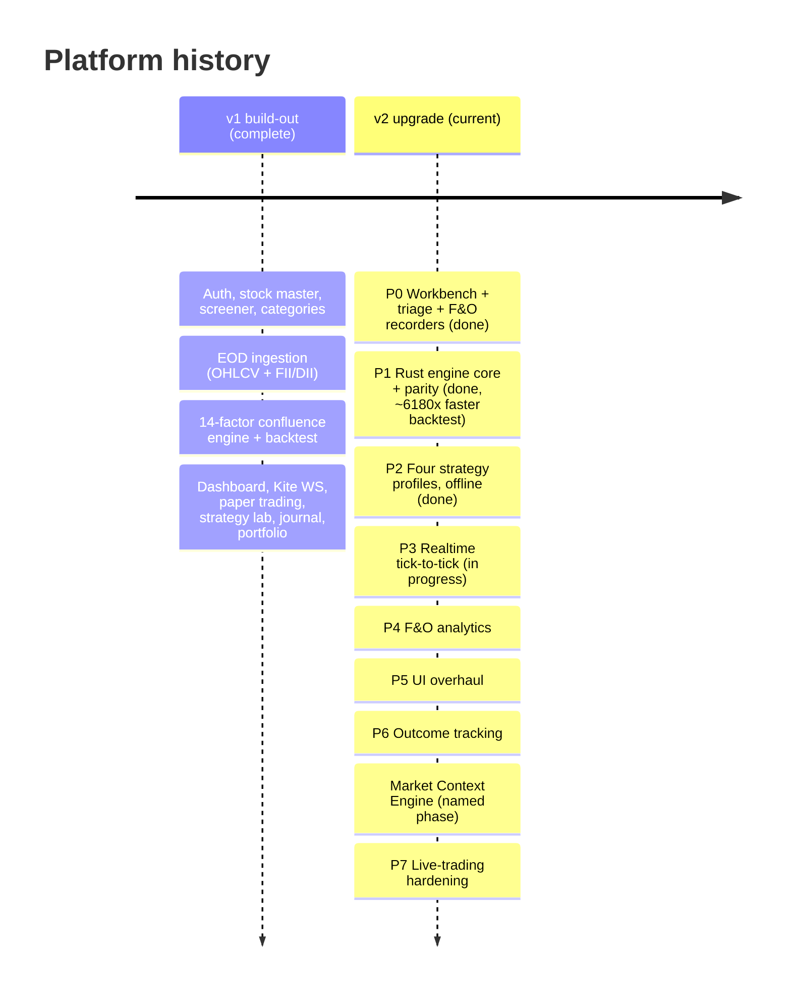
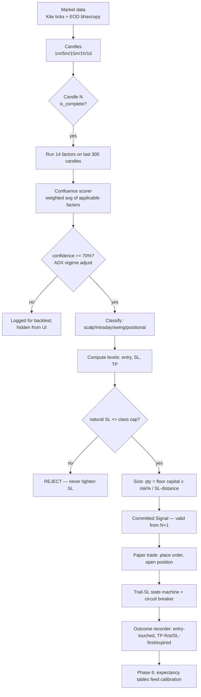

# Project Overview — the whole platform, start to end

> A single orientation document: what this system is, how it is built, how
> data flows through it, what the engine actually does, every phase we have
> shipped, and every phase still ahead. Written 2026-08-02 (v2 Phase 3 in
> progress). Companion map to the specialised docs — this is the one that ties
> them together.
>
> **Source-of-truth pointers:** `docs/UPGRADE_PLAN.md` (the *why* of v2) ·
> `docs/PHASES.md` (live status) · `docs/SIGNAL_ENGINE.md` (the edge, protected)
> · `docs/ARCHITECTURE.md` (system map + canon) · `docs/PERFORMANCE.md`
> (benchmarks) · `docs/phases/` (per-phase reports) · `CLAUDE.md` (session
> context). Where this doc and those disagree, **they win** — update this one.
>
> **Visual version** (navigable web page, same content):
> https://claude.ai/code/artifact/0d880837-a02a-4f10-99fd-5da511183d22 —
> published from this doc; the two are separate deliverables, so redeploy the
> artifact when this file changes materially.

---

## Table of contents

1. [What this is, in one paragraph](#1-what-this-is-in-one-paragraph)
2. [The two eras: v1 and the v2 upgrade](#2-the-two-eras-v1-and-the-v2-upgrade)
3. [The big picture — system architecture](#3-the-big-picture--system-architecture)
4. [End-to-end lifecycle — how a trade idea is born](#4-end-to-end-lifecycle--how-a-trade-idea-is-born)
5. [The signal engine — our edge](#5-the-signal-engine--our-edge)
6. [The Rust compute core](#6-the-rust-compute-core)
7. [The realtime layer — committed vs forming](#7-the-realtime-layer--committed-vs-forming)
8. [Paper trading, risk, and the road to live](#8-paper-trading-risk-and-the-road-to-live)
9. [The four trading styles](#9-the-four-trading-styles)
10. [Data model & the load-bearing contracts](#10-data-model--the-load-bearing-contracts)
11. [Frontend](#11-frontend)
12. [Tech stack & why each piece](#12-tech-stack--why-each-piece)
13. [The adjudicated canon — hard-won decisions](#13-the-adjudicated-canon--hard-won-decisions)
14. [Hard constraints — the non-negotiables](#14-hard-constraints--the-non-negotiables)
15. [The development workbench](#15-the-development-workbench)
16. [The phase journey — done and upcoming](#16-the-phase-journey--done-and-upcoming)
17. [Where we are now & the critical path](#17-where-we-are-now--the-critical-path)
18. [Glossary](#18-glossary)
19. [Commands & daily ops](#19-commands--daily-ops)

---

## 1. What this is, in one paragraph

A **personal intelligent stock-suggestion and algo-trading platform for the
Indian markets (NSE/BSE)**. It ingests market data (end-of-day and live
tick-by-tick), runs every stock through a **weighted confluence signal engine**
that only fires when 5–7 independent technical factors agree at the same price
level, sizes each idea off a mandatory stop-loss rule, and surfaces the result
as an actionable suggestion (entry, stop, target, quantity, and *why*). Trades
are executed in **paper mode** today; live order placement is gated behind an
explicit opt-in plus a proven profitable paper record. It is built solo, for
personal use first, with the option to productise later. The guiding principle:
**profits can't be promised, but losses are controlled by construction.**

---

## 2. The two eras: v1 and the v2 upgrade

**v1 (2025 → mid-2026, complete).** Phases 0–11 built the whole vertical:
auth, stock master, a 50-filter screener, category tagging, EOD ingestion
(OHLCV + FII/DII + bulk/block deals), the 14-factor confluence engine, a
dashboard, Kite WebSocket plumbing, paper trading with a circuit breaker, a
strategy lab, a journal, and external portfolio import. It worked — but a deep
adversarial review found the **"live" pipeline had never worked end-to-end**
(four integration bugs), position sizing was 100× too small, and the code had
quietly drifted from the signal spec. v1 Phase 12 (live trading) was never
started.

**v2 (current — approved 2026-07-03, governed by `docs/UPGRADE_PLAN.md`).**
Not a rewrite — a *foundation repair plus upgrade*. It adds a Rust compute
core, an honest tick-to-tick realtime layer, four data-driven trading-style
engines, an F&O capability, a UI overhaul, outcome tracking, and finally live
trading. The old v1 Phase 12 became **v2 Phase 7**.



---

## 3. The big picture — system architecture

Five layers, top to bottom: external sources → ingestion → compute → storage →
presentation.

```
┌─ External ────────────────────────────────────────────────────────────┐
│ Kite WS (ticks) · Kite REST (quote / historical / instruments)        │
│ NSE archives: equity bhavcopy · F&O bhavcopy · indices/VIX ·          │
│ FII/DII · corporate filings                                           │
└──────────────┬────────────────────────────────────────────────────────┘
               ▼
┌─ Ingestion ───────────────────────────────────────────────────────────┐
│ live-worker (KiteTicker thread → queue → batch loop):                 │
│   candles 1m/5m/15m/1h → Postgres · SET ltp:{sid} + pub/sub → Redis   │
│ Celery beat: EOD bhavcopies · FII/DII · filings · F&O bhavcopy ·      │
│   India VIX · option-chain snapshots (1-min, needs Kite token)        │
└──────────────┬────────────────────────────────────────────────────────┘
               ▼
┌─ Compute ─────────────────────────────────────────────────────────────┐
│ Rust engine-core (tradecore wheel): 14-factor confluence (≥70% gate), │
│   risk sizer, classifier, backtest (Rayon-parallel), LiveEngine       │
│   (forming + committed layers). Python analysis/ FROZEN at parity.    │
│ Options math: BS/Black-76 IV, Greeks, IV-rank/PCR/max-pain (Phase 4)  │
└──────────────┬────────────────────────────────────────────────────────┘
               ▼
┌─ Storage ─────────────────────────────────────────────────────────────┐
│ Postgres 16 + TimescaleDB (:5433): ohlcv_{1m,5m,15m,1h,1d} hypertables│
│   · fo_bhavcopy · india_vix_daily · option_chain_snapshots ·          │
│   signals/outcomes · orders/positions · everything relational          │
│ Redis 7 (volatile-lru): ltp:{stock_id} keys · pub/sub channels ·      │
│   Celery broker · Streams for alerts                                   │
└──────────────┬────────────────────────────────────────────────────────┘
               ▼
┌─ Presentation ────────────────────────────────────────────────────────┐
│ FastAPI /api/v1/* (JWT) · /ws/live (JWT-on-upgrade pubsub reader)     │
│ React 19 SPA: token-driven 5-theme UI · style pages (Phase 5)         │
└───────────────────────────────────────────────────────────────────────┘
```

**Process model.** Four long-lived processes plus the two datastores:
`FastAPI` (REST + WebSocket fanout) · `live-worker` (KiteTicker + embedded Rust
LiveEngine; restarts daily at token expiry with warmup + gap-fill) ·
`Celery worker + beat` (EOD ingestion, nightly signals, expiry sweeps) ·
`Postgres` + `Redis`. The tick hot path is deliberately **boring concurrency**:
ticker thread → `queue.Queue` → consumer thread → **one PyO3 call per tick
batch** → sync redis pipeline. No asyncio in the hot path (two of v1's four
live bugs were asyncio/thread impedance).

---

## 4. End-to-end lifecycle — how a trade idea is born

The journey of a single suggestion, from raw data to a tracked outcome:



Two things make this trustworthy:

- **No look-ahead.** Factors compute on candle N; the signal is valid only from
  candle N+1's open. Committed signals are evaluated **only on complete
  candles**. The tick-level "forming" layer is labelled provisional and never
  enters backtests or P&L.
- **Idempotency.** A persistent setup does not re-insert a near-identical signal
  every candle — one active signal per (stock, timeframe, direction) with a
  supersede rule.

---

## 5. The signal engine — our edge

`docs/SIGNAL_ENGINE.md` is the protected spec. The heart of the whole system.

### 5.1 The philosophy: confluence, not single indicators

A signal is **multiple independent indicators agreeing at the same price
level**. "RSI < 30, buy!" is noise — it's why most retail traders lose. The
edge is requiring 5–7 conditions to align. This is the formalisation of the
masterclass **Double Confirmation (DC1/DC2)** principle. Every signal carries
four parts: **direction** (BUY/SELL), **classification** (scalp/intraday/swing/
positional), **levels** (entry, SL, TP, quantity), and **justification** (which
factors fired, their scores, the final confidence %).

### 5.2 The factor universe (14 factors)

Each factor returns a score from −1.0 (strongly bearish) to +1.0 (strongly
bullish); `0.0` means "neutral / not applicable" and is **excluded from the
weight denominator**.

| Group | Factors | Notes |
|---|---|---|
| **Single-candle patterns** | Marubozu, Doji, Hammer, Hanging Man, Shooting Star, Paper Umbrella | Context-aware — a hammer *at support* scores; mid-trend it doesn't |
| **Multi-candle patterns** | Engulfing, Harami, Piercing/Dark Cloud, Morning/Evening Star | Star requires a full-body gap (adjudication item G) |
| **Indicators** | RSI (14), RSI divergence, MACD (12,26,9), MACD histogram, EMA cross (20/50), price vs EMA, Multibagger EMA setup, ADX+DI, Bollinger, Volume | `pandas-ta` reference math, now ported to Rust |
| **Trend (Dow Theory)** | Higher-highs/higher-lows via pivot swings (N=3 intraday, N=5 daily) | The macro context — heaviest weight |
| **Support/Resistance + Zones** | Tested S/R lines; demand/supply zones; RRBO breakout | Masterclass Class 6 zones |
| **Fibonacci** | Bounces from 0.5 / 0.618 / 0.786 retracements | |
| **FII/DII institutional flow** | 5-day net-buy/sell thresholds; sector alignment | Lighter weight; sector-level for most stocks |

### 5.3 The confluence scorer

```python
total_weighted = sum(f.weight * f.score for f in factors)
total_weight   = sum(f.weight for f in factors if f.score != 0)   # applicable only
normalized     = total_weighted / total_weight                    # -1 .. +1
confidence_pct = int(abs(normalized) * 100)                        # int() truncation is canon
if confidence_pct < 70: return None                                # gate
direction = "BUY" if normalized > 0 else "SELL"
```

**Weight semantics (adjudicated, item H):** every factor carries its own weight
independently — related indicators are *separate* factors, not shares of a
group budget. The denominator is the sum of weights of factors that *actually
scored*, so **four factors firing decisively beats fourteen firing weakly.**
Sharing group weights was measured to badly loosen the gate (~400 extra weak
trades) and rejected.

**ADX regime adjustments (§4):** ADX < 20 (weak trend) → require +5% extra
confidence; ADX > 40 (strong trend) → threshold drops to 65%. ATR(14) > 3% of
price (volatile) → reduce position size 25% (a *risk* rule, not an alpha rule).

**Worked example (real engine output):** POWERGRID, 1d. Four factors fired —
Bullish Engulfing (+13.50), RSI rising (+6.00), at-support (+8.50), Fib 0.5
bounce (+2.00) = +30.00 over applicable weight 40 → 0.75 → **75% BUY**. Entry
₹288.20, SL ₹278.40 (last swing low, 3.4% — inside the 8% swing cap), TP
₹305.49 (6% RRBO target), qty 1020 at ₹5L capital / 2% risk. Output:
*"Buy POWERGRID — Bullish Engulfing at support, RSI rising, 75% confidence."*

### 5.4 Classification, validity, sizing

- **Classification** by which timeframe contributed the strongest confluence:
  1m/5m → scalp · 15m/1h → intraday · 1d → swing · 1d+Multibagger or 1w →
  positional.
- **Validity (expiry):** scalp 30 min · intraday until 3:15 PM IST · swing
  **5 trading days** · positional **30 trading days**. Trading-day arithmetic
  uses the NSE holiday calendar — calendar-day math is a bug. An expiry sweeper
  runs every 5 minutes.
- **Position sizing (mandatory, every signal):**
  `qty = floor(capital × risk% / |entry − SL|)`. `risk_pct` is a whole percent
  (2.0 = 2%). **Reject, never clamp:** if the natural SL exceeds the class cap
  (scalp/intraday 0.5%, swing 8%), the signal is rejected — you never tighten
  an SL to fit.
- **Trailing stop:** at first target, close 50% and move SL to breakeven; at
  the next 6% target, book 25% more and trail again. State lives in `positions`
  (`trail_state`, `trail_sl_price`).

---

## 6. The Rust compute core

The `engine/` Cargo workspace, added in v2, is the platform's compute heart.

**Three crates:** `engine-core` (pure logic — no I/O, no clocks, no randomness:
incremental indicators, pattern detectors, pivots/Dow/S&R/Fib, the confluence
scorer, the risk sizer, the Rayon-parallel backtest loop, and Black-Scholes
options math) · `engine-py` (the PyO3/maturin wheel `tradecore`) · `engine-cli`
(a native binary for replay and benchmarks without Python).

**Why Rust.** The honest bottleneck was never the tick path (500 instruments ≈
500–2000 ticks/s is trivial) — it was the **backtest/tuning loop**: the pandas
engine re-sliced and recomputed full-window indicators per candle (O(n²)), and
weight-grid / walk-forward searches over minute data were simply infeasible in
Python. Reusing the *same compiled engine* live then eliminates the entire
class of live-vs-backtest drift bugs v1 exhibited.

**The payoff (measured, parity-proven first):**

| Benchmark | pandas (frozen) | Rust engine-core | Speedup |
|---|---|---|---|
| 2y × 49-stock full backtest | 883.8 s | **0.143 s** | **~6,180×** |
| 200-combo weight grid | ≈ 50.5 h | **≈ 29 s** | ~6,200× |
| Single confluence eval | 44.5 ms | ~6.5 µs | ~6,800× |

**The migration contract (parity is sacred).** The Python `analysis/` code was
**frozen** at Phase 1 (bugfix-only). Committed golden fixture files, generated
from the frozen Python, are the oracle (the exact pandas-ta version is recorded
inside each fixture). Tolerances are tiered: 1e-9 relative for the EMA family,
1e-6 for the Wilder family (RSI/ADX/ATR), and **exact equality on factor
scores, confidence integers, and signal decisions**. A live shadow week runs
Rust-decides / Python-double-checks with zero decision diffs required; only
then does the Python factor code get deleted. Numeric canon: money is `i64`
scaled 1e-4 (matches `Numeric(12,4)`), indicator math is f64, "not applicable"
is `Option::None` never a 0.0 sentinel.

---

## 7. The realtime layer — committed vs forming

Phase 3's core idea: **two deliberately distinct output layers**, separated at
the type level so provisional data can never contaminate real decisions.

- **Committed signals** — candle-close only, spec-exact, no repainting,
  backtestable, idempotent. Evaluated in-process in Rust (µs) instead of Celery
  (seconds). At most once per (timeframe, period) per engine lifetime — *no
  repaint by construction*.
- **Forming / live layer** — tick-to-tick: entry-zone touches, PDH/PDL and
  S/R breakout crosses, SL/TP proximity for open positions, volume bursts,
  provisional confidence on the *forming* candle (labelled "forming"), and
  per-style leaderboard re-ranks. Batched at 2–4 Hz. **Never enters backtests
  or P&L.** Alerts go through Redis Streams (at-least-once, durable); LTP goes
  through pub/sub (fine to drop). The frontend reconciles committed state over
  REST on reconnect.

**The tick pipeline:**

```
KiteTicker thread → bounded queue.Queue → consumer thread
  → ONE tradecore.LiveBook call per tick batch
  → sync redis pipeline: SET ltp:{stock_id} + PUBLISH ltp/candle + XADD alerts
Committed candles → blocking writer queue → writer thread → Postgres upsert
  → Celery trigger fires AFTER the commit
```

**Backpressure:** drop-oldest for LTP-class data, **never** drop a
candle-closing tick. **Session guard in-engine:** ticks before 9:15 / at-or-
after 15:30 / with non-positive price are rejected and *counted*, never minted
into candles. **Daily token expiry** (~6 AM IST) is a normal lifecycle event —
process restart + warmup + gap-fill, not an error loop.

**Latency budget:** tick → Redis publish **p99 ≤ 50 ms at full universe
(~2,055 instruments)** — MET across two full sessions on the optimised worker.
(The original 10 ms target was authored for 200–500 instruments and restated by
user ruling at full scale.) A **record/replay harness** is a mandatory
deliverable — recorded tick sessions replay to byte-identical event streams,
proven across four full-day soak recordings; replay tests run in CI.

---

## 8. Paper trading, risk, and the road to live

**Paper mode is the default and the only live path today.** `place_order` is
paper-only — there is no Kite order/GTT path yet (that is Phase 7). The paper
broker simulates fills entirely in software.

The risk machinery that controls losses by construction:

- **Mandatory position sizing** off SL distance (§5.4).
- **Max-SL rejection** — signals whose natural SL exceeds the class cap are
  rejected, not clamped.
- **Honest fills (adjudication item E + the 2026-08-01 program):** gap-through
  exits book the **gapped market price**, not the stop; the fill candle is
  checked intrabar; SL is checked before TP. Adverse slippage is on by default
  (`paper_slippage_bps`, 2 bps). Zerodha round-trip charges (STT, stamp,
  exchange, GST, brokerage) are modelled so P&L is **net**.
- **The daily-loss circuit breaker** — never disableable, never weakened, never
  configurable-off. Not for tests, not on request.
- **Trail-to-breakeven state machine** — locks in gains as targets are hit.

**The go-live gate.** Live trading requires an explicit user opt-in **and** a
30-day profitable paper record, enforced in code (not by promise). The paper
clock restarted 2026-07-03 (the sizing-bug fix invalidated prior history) and
restarts again under any change to the fill model (a reset endpoint +
`users.paper_clock_started_at` exist for this). Phase 6 will replace the
"30 calendar days" gate with a stronger "N trades across ≥2 regimes, positive
expectancy, bounded max drawdown" rule.

**Honesty note.** No system guarantees profits. The truthful adjudicated
baseline on 2023–26 daily data is **negative** — the old flattering +P&L was
fill-flattery. Profitability is the job of Phase-2 profiles (the `rrbo` swing
profile already walk-forwards **positive: +41.3% / +1.97 Sharpe**; `dc1`/`dc2`/
`multibagger` are flagged) and Phase-6 tuning, now measured against reality.

---

## 9. The four trading styles

One confluence framework, four **data-driven strategy profiles** (versioned
rows with their own weights, timeframes, universe, validity, and risk
templates). New factors always enter *through* the confluence framework — never
as standalone triggers.

| Style | Core setups | Timeframes |
|---|---|---|
| **Intraday** | DC1/DC2 double-confirmation · PDH/PDL breakout · opening-range breakout · 9:25 gainer/loser · 10 AM strategy | 5m/15m (+1h context) |
| **Swing** | RRBO (resistance breakout + 1.5× volume) · pullback-to-demand-zone | 1d (+1h refinement) |
| **F&O** | Futures directional (underlying confluence + OI confirmation) · option-selling candidates (IV rank, PCR, max pain, regime gates) | per expiry |
| **Investment** | Multibagger EMA setup · relative strength vs Nifty · FII/DII + sector alignment | 1d/1w |

**F&O data before F&O analytics.** Recorded history is the scarce resource, so
two cheap recorders started back in Phase 0 and have been accumulating since:
F&O bhavcopy ingestion (per-contract close/OI/volume → EOD IV → IV-rank/PCR/
max-pain) and 1-minute intraday chain snapshots via `kite.quote`. India VIX is
the interim IV-regime proxy. The actual analytics (Rust Black-Scholes IV/Greeks,
the chain builder, option-selling suggestions) land in Phase 4.

---

## 10. Data model & the load-bearing contracts

**Postgres + TimescaleDB (port 5433 locally).** Two data shapes in one
database: relational (users, signals, orders, positions, journals, categories,
portfolio) and time-series (OHLCV hypertables). Key tables:

- **Hypertables:** `ohlcv_1m / 5m / 15m / 1h / 1d` (time-partitioned candles) ·
  `option_chain_snapshots` (7-day chunks) · `fo_bhavcopy` · `india_vix_daily`.
- **Signals & outcomes:** `signals` (committed suggestions with factor
  breakdown) · `signal_outcomes` (tick-level first-touch ladder: open →
  entry_touched → tp_first / sl_first / expired).
- **Trading:** `orders` · `positions` (with `peak_price`/`peak_pnl` MFE,
  `exit_price`/`exit_reason`, `trail_state`/`trail_sl_price`).
- **Master & research:** `stocks` (with `ca_flagged_at`/`_reason` for
  corporate-action quarantine) · `categories` · `strategy_profiles` (versioned)
  · `watchlists` · `journal` · portfolio/CAS tables · `market_calendar` (NSE
  holidays).

**Money is always exact:** `Decimal` in Python, `Numeric(12,4)` in Postgres,
`i64` scaled 1e-4 in Rust. Storage is UTC; market logic is IST (the half-hour
offset makes date-boundary bugs easy — all datetimes are tz-aware).

**Redis contracts (memorise these — they are how components talk):**

| Contract | Producer | Consumer | Shape |
|---|---|---|---|
| `ltp:{stock_id}` KEY (TTL 600s) | live-worker | paper broker SL/TP | Decimal string; import `LTP_KEY`, never retype |
| `ltp:{instrument_token}` channel | live-worker | /ws/live fanout | JSON tick |
| `candle:{table}:{stock_id}` channel | live-worker | /ws/live fanout | candle JSON + `is_complete` |
| `alerts:live` Stream | live-worker | outcome recorder + WS | durable (at-least-once) |
| WS close code **4401** | /ws/live | frontend | auth failure — client must NOT auto-reconnect |

Anything that must not be lost uses Redis **Streams** or the DB — never bare
pub/sub. Every cache key gets a TTL (eviction is volatile-lru; TTL-less keys
are treated as broker-critical and never evicted).

---

## 11. Frontend

**React 19 · TypeScript 6 · Vite 8 · Tailwind 4 (token-driven) · Zustand +
TanStack Query.** Feature areas under `src/features/`: `dashboard`, `trading`,
`stocks`, `screener`, `strategy`, `journal`, `portfolio`, `analytics`,
`alerts`, `watchlists`, `filings`, `categories`, `market`, `broker`, `golive`,
`styles`, `profile`.

The rules that keep money-rendering honest (full detail in `docs/UI_GUIDELINES.md`
and `.claude/rules/ui.md`):

- **Colours are tokens only.** Five themes (slate default, midnight, carbon,
  ocean, daybreak) switched by `data-theme`. Profit/loss via `--color-profit` /
  `--color-loss`; direction is always **glyph + colour** (▲/▼), never colour
  alone. No hardcoded hex, no `text-green-500`, no `dark:` variants.
- **Numbers exclusively through `lib/format.ts`** (`formatCurrency` with Indian
  grouping, `formatPct`, `formatChange`, `formatLakh`). No `toFixed` /
  `toLocaleString` in features. Numeric columns are right-aligned `tabular-nums`.
- **Tables** (the app is mostly tables): sticky opaque headers, zebra rows,
  skeleton loading, explicit empty/error states. ≥200 rows or live-updating →
  TanStack Virtual + memoised rows. Live prices flash via the `PriceCell`
  pattern (250 ms pulse), never a full-row re-render per tick.
- **Live data** via `useLiveQuotes` (WebSocket, token as `?token=`, no
  auto-reconnect on 4401); tick updates are rAF/interval-batched, never one
  setState per tick.
- **Auth:** JWT — access token 45 min in memory, refresh 7 d in an httpOnly
  cookie, rotated on every refresh.

---

## 12. Tech stack & why each piece

| Layer | Choice | One-line why |
|---|---|---|
| Backend | Python 3.12 · FastAPI (async) · SQLAlchemy 2 async + asyncpg | Native async for WS fanout; the quant ecosystem is Python |
| Task queue | Celery + Redis | Battle-tested scheduled jobs (EOD, expiry sweeps, nightly signals) |
| Compute core | Rust workspace → `tradecore` wheel (PyO3) | 100–1000× faster tuning; one engine for live + backtest |
| Database | PostgreSQL 16 + TimescaleDB (:5433) | One DB for relational + time-series with cross-joins |
| Cache/bus | Redis 7 (volatile-lru) | Sub-ms LTP reads, pub/sub fanout, Streams for durable alerts |
| Frontend | React 19 · TS 6 · Vite 8 · Tailwind 4 · Zustand + TanStack Query | Largest financial-chart ecosystem; type safety on money |
| Charts | TradingView Lightweight Charts · Recharts | The real candlestick engine; Recharts for dashboards |
| Auth | JWT (access in memory + refresh httpOnly, rotation) | XSS-safe, short-lived, CSRF-mitigated |
| Broker | Zerodha Kite Connect | Cheapest serious option; 10y history; most mature Indian SDK |
| Testing | pytest (real PG+Redis, no mocks) · Vitest + RTL · cargo test | Test the seams, not just units |
| Tooling | uv · ruff · mypy (strict) · eslint · maturin · pnpm | Fast, strict, reproducible |

Explicitly **not** picked: GraphQL, MongoDB, microservices, Kubernetes, Kafka
(Redis pub/sub is enough at personal scale). Deployment is Docker Compose →
optional single VPS; Caddy for auto-HTTPS when it deploys.

---

## 13. The adjudicated canon — hard-won decisions

Before generating the Rust oracle, eight spec-drift questions were **measured on
2y × 49 Nifty50 real data** and decided with the user. These are load-bearing —
they define correct behaviour:

| # | Decision | Why |
|---|---|---|
| A | Volume counts only *with* the confluence direction | +41.6 total P&L; it was wrongly dampening bearish setups |
| B | RSI ±0.4 bands at <30/>70 removed (off-spec) | Neutral; not in the spec |
| C | ONE swing-SL: pivot N=5 for live *and* backtest; wrong-side SLs rejected | +44.2, killed live-vs-backtest drift |
| D | Committed signals see exactly the last ≤300 completed candles, everywhere | 99.7% agreement, 0 direction flips vs infinite memory |
| E | Honest fills: gap-through exits at open, fill candle checked intrabar, SL before TP | Revealed the old +1.8 P&L as fill-flattery (truth: negative) |
| F | ATR(14) > 3% of price → qty reduced 25% (a risk rule) | Accepted knowingly: costs some P&L for much less capital-at-risk |
| G | Star patterns require a full-body gap (strict) | 78% of old star detections were false; corpus flipped to +52.1 P&L |
| H | Per-sub-factor weights (not shared group budgets) | Sharing loosened the gate badly (~400 weak trades) |

**Standing baseline** (post F+G, pinned corpus): 599 trades · win% 40.1 ·
totPnL +52.1 · Sharpe +0.13 — the first positive corpus baseline; the Rust
engine-cli reproduces the 599 trades exactly in 172 ms.

**Corporate-action policy:** raw NSE bhavcopy stays canonical and is never
auto-adjusted. A discontinuity detector (|open ÷ prev_close − 1| > 20%)
quarantines the stock (`ca_flagged_at`), excluding it from suggestion universes
until reviewed. Adjusted and raw sources are never mixed within one indicator
window.

---

## 14. Hard constraints — the non-negotiables

From `.claude/rules/trading-domain.md` — these override convenience, deadlines,
and "just this once":

1. **Confluence only.** No signal from a single indicator, ever. ≥70% gate.
2. **No look-ahead.** Compute on N, valid from N+1; committed signals from
   complete candles only; the tick layer never enters backtests.
3. **No repainting.** A committed signal's factors are frozen at commit time.
4. **Position sizing mandatory** on every signal; `risk_pct` is a whole percent.
5. **Reject, don't clamp** SLs that exceed the class cap.
6. **Validity per classification** using the NSE trading-day calendar.
7. **Money = Decimal / Numeric(12,4) / i64·1e-4.** Storage UTC, logic IST, all
   tz-aware.
8. **Paper default; live requires opt-in + 30 profitable paper days.** The
   daily-loss circuit breaker is never disableable.
9. **Kite discipline:** token expiry is a lifecycle event, not an error; all
   REST goes through the shared throttled client (~3 rps).
10. `docs/SIGNAL_ENGINE.md` is the edge — **protected by a hook**; spec changes
    require explicit user instruction + a §8 backtest regression.

---

## 15. The development workbench

This is a solo project engineered like a team's, using the Claude Code
workbench (`.claude/`):

- **Hooks** (`.claude/settings.json` + `.claude/hooks/`): auto-format on edit;
  destructive-command guard; protected-file guard (SIGNAL_ENGINE.md, applied
  migrations, `.env` can't be silently edited). *If a hook blocks you, it's
  working.*
- **Subagents** (`.claude/agents/`), each with a strict findings contract:
  `quant-verifier` (formula-by-formula vs the spec; look-ahead / incomplete-
  candle / float-money hunting) · `bug-hunter` (async/thread races, tz,
  boundaries, leaks) · `ui-reviewer` (tokens, format.ts, portals,
  virtualization) · `perf-auditor` (per-tick allocations, N+1, sync-in-async,
  Rust hot-path clones) · `test-guardian` (tests-with-feature, hollow-assert
  detection).
- **Rules** (`.claude/rules/`): trading-domain · python · typescript · rust ·
  testing · ui — loaded per the files you touch.
- **Skills:** `/vertical-slice` (the feature workflow: model → migration →
  service → API → frontend → tests) · `/phase-gate` (the phase-exit ritual) ·
  `/signal-audit` (verify a profile against spec) · `/perf-bench` (benchmarks +
  the PERFORMANCE.md protocol).

**Definition of done** (per feature): `make check` green (pytest + ruff + mypy
+ vitest + eslint + tsc, plus cargo gates) · tests shipped with the change ·
reversible migration · manual smoke · CHANGELOG under Unreleased · relevant
subagent review clean · phase report updated when a phase item closes.

Every phase writes a report to `docs/phases/` (goal → why → what was built →
results/metrics → decisions) so future-you knows why every piece exists.

---

## 16. The phase journey — done and upcoming

### v1 build-out (complete)

| # | Phase | Status |
|---|---|---|
| 0–4 | Infra · Auth · Stock master + screener · Categories · EOD ingestion | ✅ |
| 5 | Signal engine offline (14 factors, ≥70% confluence, backtest) | ✅ |
| 6–7 | Dashboard + filings/event-guard · Live data via Kite WS | ✅* |
| 8–11 | Paper trading + circuit breaker · Strategy lab · Journal · Portfolio | ✅ |
| 12 | Live trading | → became v2 Phase 7 |

\* v1 Phase 7 shipped with four integration defects (dead live path) — repaired
with regression tests in v2 Phase 0.

### v2 upgrade

| # | Phase | Status | Headline |
|---|---|---|---|
| 0 | Workbench · triage · F&O recorders | **✅ done** | git+hooks/agents/rules · 9 defects fixed (dead live pipeline, 100× sizing) · F&O recorders live |
| 1 | Rust engine core + parity + benches | **✅ done** | tradecore wheel · exact cross-language parity · 2y×49 backtest **883.8 s → 0.143 s (~6,180×)** |
| 2 | Strategy profiles — 4 style engines, offline | **✅ done** | versioned profiles + 8 seeds · NSE calendar · walk-forward evidence (rrbo +41.3%/+1.97; others flagged) |
| 3 | **Realtime v2 — tick-to-tick** | **▶ in progress** | live-worker + Rust LiveEngine · committed vs forming · record/replay · slices 3.0–3.7 done · **remaining: quiet-box soak (p99 ≤ 50 ms UNPROVEN) + clean shadow week** |
| 4 | F&O analytics | planned | chain builder · Rust IV/Greeks · IV-rank/PCR/max-pain · option-selling suggestions |
| 5 | UI overhaul | planned | new sidebar IA · slate theme · 4 style pages · chain ladder · virtualized live tables @60 fps |
| 6 | Outcome tracking + strategy lab v2 | planned | per-style hit-rate/expectancy · factor attribution · Rayon weight tuning + promotion workflow |
| — | **Market Context Engine** (named phase after 6) | planned | news/sentiment/VIX/PCR as **gates & modifiers**, never additive; top-down NIFTY-vs-200DMA + VIX gate; earnings blackout |
| 7 | Live-trading hardening | planned | Kite orders behind trading_mode + 30-day gate · RiskEngine single-gate first · exchange stops (GTT/SL-M) · kill switch · reconciliation |

**Phase 3 detail (current).** Slices 3.0–3.7 harness are done: the Rust
LiveEngine, session-aligned 1h rebuild, the live-worker process, the record/
replay harness (byte-identical across four full-day soak recordings), tick
triggers + the provisional layer + leaderboards, outcome-tick recording, and
the shadow-compare harness (2,293/2,293 decisions matched exactly on a real
day). What remains (both live-gated, need market days): a **clean shadow week**
(`scripts/shadow_day.sh`, zero diffs) and a **quiet-box full-session soak** for
the **p99 tick→publish ≤ 50 ms verdict — still UNPROVEN** (the 2026-07-10 soak
was PARTIAL: a load spike on the box starved the consumer and Kite dropped the
WS; stability behaved as designed, but the latency verdict stayed open). Then
the Phase-3 exit gate. The **30-day paper clock** runs daily already, but it
gates **Phase 7**, not the Phase-3 exit.

**Phase 4–7 plus the Market Context Engine** are the road to live. The order is
deliberate: **F&O analytics → UI overhaul → outcome tracking/calibration →
Market Context Engine → live-trading hardening.** Phase 7 opens with a
**RiskEngine single-gate consolidation** (test-first, equivalence-pinned) — it
closes the caller-side circuit-breaker seam *before* the live-order path exists,
the exact class of bug that gave v1 its four integration defects. The
architectural moves for Phase 7 (event bus, in-memory cache, ExecutionEngine +
BrokerAdapter port, order FSM, reconciliation) are studied in
`docs/NAUTILUS_TRADER_ANALYSIS.md` — **learned, not vendored.**

### The backlog (phase-mapped, from the 2026-08-01 architecture review)

- **Phase 6:** empirical regime-conditional **expectancy tables**
  (confidence × class × regime → resolved TP-first %, avg R) — *calibration
  only, never auto-adapting weights*; signal-level MFE/MAE; replace the
  "30 calendar days" go-live gate with an expectancy-based one. Plus the
  PKScreener setup-catalog harvest (candidate factors, through confluence) and
  a possible Kronos confidence-input research experiment.
- **Market Context Engine:** proactive earnings blackout; one simple top-down
  market/sector gate (NIFTY < 200-DMA or high VIX → downweight longs). **Not** a
  multi-state regime engine.
- **Phase 7:** exchange-resident protective stops (Kite GTT/SL-M) as the primary
  live exit; an LTP-absence alarm for open live positions; sector-exposure caps
  + a single total-open-risk number; corporate-action adjustment of *open*
  positions through ex-dates.
- **Rejected against this system:** auto-adaptive/self-learning weights
  (curve-fits, breaks frozen-engine discipline) · VaR/Expected Shortfall ·
  execution algos (VWAP/TWAP/iceberg — irrelevant at this size) · rolling
  correlation matrices.
- **Consciously deferred:** mobile native app · Account Aggregator · AI/ML
  signal generation (only after the rule engine proves out) · multi-tenancy/
  SaaS · MCX commodities · FinBERT sentiment. See
  `docs/EXTERNAL_LIBS_REVIEW_2026-08-02.md` for the verdict on IndiaFenix / LEAN
  / VectorBT / PKScreener / NSEPython / Kronos (adopt none as dependencies).

---

## 17. Where we are now & the critical path

**Today (2026-08-02): v2 Phase 3, backend harness complete.** The engine is
Rust, parity-proven, and ~6,180× faster on backtests. The live pipeline is
event-driven, soak-tested, and replay-deterministic. Paper trading books net
P&L with honest fills. The credibility layer (fees, off-market guards, the
paper-record card, the go-live gate UI + client kill-switch) shipped.

**The critical path to live trading:**

```mermaid
flowchart LR
    A[Phase 3 harness DONE] --> B[Live shadow week<br/>zero decision diffs]
    B --> C[Full-session live soak<br/>starts 30-day paper clock]
    C --> D[Phase 3 exit gate]
    D --> E[P4 F&O analytics]
    E --> F[P5 UI overhaul]
    F --> G[P6 Outcome tracking<br/>+ expectancy calibration]
    G --> H[Market Context Engine phase]
    H --> I[P7 Live hardening<br/>RiskEngine gate first]
    I --> J[30 profitable paper days<br/>+ kill-switch tested]
    J --> K[1-stock live pilot]
```



Nothing on this path is blocked on external libraries or a rewrite — it's
disciplined execution of an already-designed plan, one soak-clean phase at a
time. Live trading is the *last* thing, guarded by the non-disableable circuit
breaker and a paper record that had to be earned.

---

## 18. Glossary

- **Confluence** — multiple independent factors agreeing at one price level; the
  platform's edge and its hardest constraint.
- **Committed vs forming** — committed signals are candle-close, spec-exact, and
  backtestable; forming/provisional is tick-level, labelled, and never enters
  P&L or backtests.
- **DC1 / DC2** — Double Confirmation (masterclass): reversal at a demand/supply
  zone with a confirming pattern.
- **RRBO** — Resistance Range BreakOut (swing): break above resistance with a
  body candle and ≥1.5× volume.
- **PDH / PDL** — Previous Day High / Low; intraday breakout references.
- **The gate** — the ≥70% confidence threshold (65% in strong-ADX regimes).
- **Parity / golden fixtures** — committed oracle files from the frozen Python
  that the Rust engine must reproduce exactly.
- **The paper clock** — the 30-day profitable-paper-trading counter that gates
  live trading; restarts whenever the fill model changes.
- **Soak** — a full market-session run of the live worker to prove stability and
  latency before trusting the pipeline.
- **tradecore** — the PyO3 wheel built from the Rust `engine/` workspace.

---

## 19. Commands & daily ops

```
make up / down          postgres + redis (pg on 5433)
make backend            uvicorn dev server
make frontend           vite dev
make worker             celery worker + beat (REQUIRED for EOD ingestion +
                        nightly signals; stop it during soaks)
make live-worker        supervised live tick worker (WORKER_ARGS=--gap-fill)
make migrate            alembic upgrade head
make create-admin       create the admin user
make test / lint / typecheck / check    (check = the full gate)
make engine-build/test/bench/parity     (Rust)
cd backend && uv run pytest tests/<file> -q     (targeted)
```

**Daily ritual (once a Kite subscription is active):** the token dies ~6 AM IST;
re-login with `cd backend && uv run python scripts/kite_login.py` (terminal
only). Start `make worker` before ~18:30 IST so the evening EOD beats self-heal
and generate signals; run `make live-worker WORKER_ARGS=--gap-fill` pre-open to
heal the intraday hole for the subscribed universe. The chain-snapshot recorder
auto-activates whenever a live token exists.

**Machine notes (this dev box):** i7-1355U, 15 GB RAM — cap `RAYON_NUM_THREADS`
≤ 6 (thermals); run the test gate as three sequential legs (not-parity/parity/
walkforward) to avoid OOM; `git push` is manual by design (credential-free
remote).

---

*This document is a living map. When a phase closes or an architecture decision
changes, update it here and in the specialised doc it points to.*
